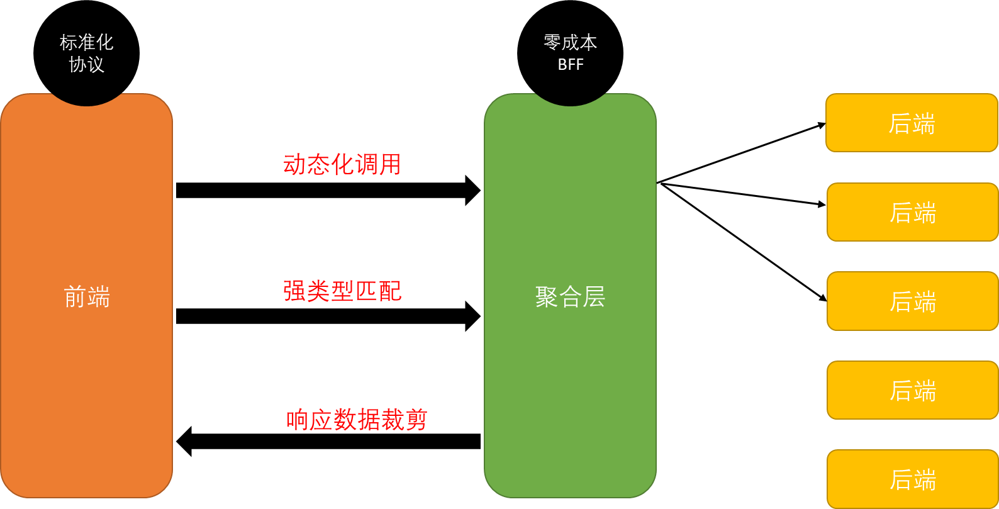
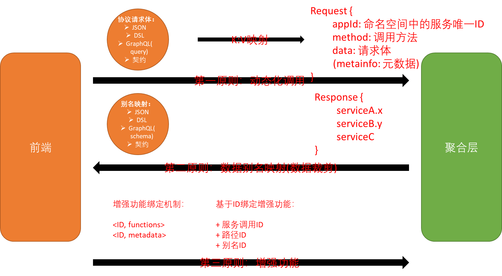

# 零成本BFF解决方案 - CapaBFF

### 携程集团2021 "Hackthon黑客马拉松大赛" 金奖项目

## 1. 为什么需要零成本BFF？

在传统的前后端接口开发和交互流程中，存在以下几个问题：

+ 服务端需要根据不同终端需求，不断调整接口逻辑
+ 服务端数据裁剪开发成本高，不同终端需要定制调整
+ 部分现有方案（GraphQL）成本高，且需要聚合层开发


综上，对于前端/聚合层/服务端，总要有一方，需要不断调整开发，导致开发成本高

所以，我们期望一套低成本的各端交互方式。

## 2. 设计思路

### 2.1 理清思路

为了解决前后端开发时需要不断调整接口的问题，首先需要引入新的层次-聚合层BFF（为什么引入BFF不再赘述）。

传统的类似GraphQL的聚合层，在解放了前后端同学的同时，需要聚合层同学不断的开发适配，仍然存在很大的开发成本。

所以我们希望在聚合层实现"零成本BFF"这样的特性，使得聚合层同学的代码"一次编写，永远运行"。

但现实是后端的接口总是不断变化的，所以要实现零成本BFF，一定需要我们的调用协议支持"动态化调用"，这样才能使聚合层无需再次开发。

以及，针对前端不同端的数据要求，对于同样的接口调用逻辑，可能关注的响应参数各不相同。
所以，我们需要协议支持"响应数据裁剪"这样的能力，根据前端不同的要求对组合调用的响应体进行裁剪。

而对于像GraphQL-BFF这样的方案，其基于schema的强类型约束对于工程有较大的辅助作用，例如可以做到类型参数校验等。
所以，我们也希望我们的标准化协议，尽量支持"强类型匹配"这样的约束能力。

以上，是我们对于零成本BFF的解决思路的梳理。



### 2.2 技术选型

理清思路之后，我们开始对市面上的产品进行调研，并对最终的技术栈进行选择。

基于以上讨论的内容，我们最关注的点是什么？其实是如何最大化的降低开发成本。

所以，"零成本BFF"是最核心的价值。

我们假设聚合层必须具备"零成本BFF"的能力，那么很容易可以反推出来，其协议必需具备"动态化调用"的能力。
因为只有做到动态化调用，才能在聚合层无需开发的情况下，适配到不同的后端接口。

接下来调研现有的一些协议：

动态化往往都是弱类型，例如JSON为代表，以及也可以自定义一套DSL。

而对于GraphQL和protobuf的fieldmask，它们都是强类型约束的代表，强类型有强类型的好处，
但却无法原生的支持动态化调用的能力。

看起来，动态化调用和强类型约束只能二选一了。
当然，没有什么是引入新的一层解决不了的。如果要同时具备这两个特性，那么一个方式就是引入新的一层——"契约层"

> 后端将所有的强类型契约写入契约系统；前端依赖契约系统，从而实现协议的强类型约束；聚合层依赖全量的契约系统，从而实现动态化调用的能力。

如果要做成一套强健的系统，看起来引入"契约层"可以兼具两项特性，是更好的选择。
但因为复杂度等因素，该次比赛我们不考虑引入新的层级，仅在(前端/聚合层)两个系统间进行协议的设计。

所以，我们选择"动态化调用"的特性，而放弃了"强类型约束"特性。
基于此，我们选择自己实现一套DSL（类似JSON），来作为动态化调用的协议。


## 3. 抽象原则

任何系统的背后，应该都是有设计原则的。

在进行完技术选型之后，我们开始思考，BFF的设计背后潜藏着什么原则呢？

无论是GraphQL还是JSON，只要找到背后的设计原则，是不是就可以做出一套通用的系统，可以适配到不同的具体实现上呢。

最终，我们思考出了以下三条原则：



### 原则一：动态化调用

要实现动态化调用，我们需要什么？

对于每个微服务治理体系（dubbo、springcloud、istio等）而言，要想调用到唯一一个服务，需要哪些参数？

其实无非就是三元组：（appId, methodName, data），再加上一个metadata。

所以无论前端传过来的协议是什么，包含哪些内容，只要最终能够解析成一个三元组的集合(Set<三元组>)，就能实现动态化调用的能力。

例如：

+ JSON、DSL等弱类型协议，可以显式的指定appId, methodName, data等
+ 若有契约系统，可以只传过来契约ID，再解析为背后对应的appId, methodName
+ GraphQL中，前端传过来的是schema，但GraphQL引擎会把对应的schema解析成为一组服务

综上，我们设计的DSL，只要显式的指定需要调用服务的三元组集合，即可动态化调用后端的服务。

### 原则二：数据别名映射（数据裁剪）

要实现数据裁剪，我们需要什么？

基于原则一，我们拿到了一个Set<服务调用三元组>，我们现在可以分别发起调用了。

如果什么也不做，那么最后返回给前端的，可能是一个Set<服务调用的结果>。

存在什么问题呢？

首先，每个服务的响应都是一个单独的"命名空间"，但对于前端来讲，他们可能更希望一次调用返回的数据都放在一个命名空间中。

然后，考虑相互依赖的情况，服务A的请求参数依赖服务B的返回值。这时候如果服务A/B的响应数据放在不同的命名空间中，
那就需要跨命名空间进行参数传递，会比较复杂。

那我们看看graphQl是怎么做的，对于一次调用，其实返回值就是一个schema，这个schema可能熔合了很多服务的返回值，并进行了数据的组合和裁剪。

所以，我们应当把一次调用，视作同一个命名空间。
为了将不同的接口响应放到这同一个命名空间中，我们需要引入"别名空间"的概念。

为每个服务的响应，指定其映射到"别名空间"的别名。
这样，对于相互依赖的情况，直接基于别名进行依赖即可。
对于数据裁剪，只需要裁剪别名即可。

综上，应当具备"别名空间"映射的能力。而对于DSL而言，通过KV将真实的路径映射到别名即可。

### 原则三：基于ID的增强功能

我们在调研GraphQL的各项拓展功能时，发现其可以通过'@'的方式，添加一些函数增强功能。

而对于这种使用方法，其本质上是对某个对象进行函数操作。

我们认为，对于所有的增强功能，应该也有一套清晰的规则。

什么东西能被函数增强呢？我们认为是ID。

在以上系统中，ID是什么：

+ 服务调用appId+method，可以视作服务粒度的ID
+ 真实的请求/响应的字段的路径，可以视作ID
+ 别名空间中的别名，可以视作ID

基于以上ID的定义，我们可以针对ID粒度进行函数增强。

无论是使用'@'注解方式，还是其他方式，只需要针对ID即可。

而对于我们的这套DSL，通过定义特殊关键字，可以为每个ID注入操作函数。

## 4. 合作分工


有了清晰的抽象原则设计，那么可以将其抽象为代码的接口。

通过定义每个模块的接口，并核对接口间交互的契约格式。

我们可以做到模块化的分工，每个同学实现自己模块的接口，然后通过自测方式确保没问题。
最后，进行联调。

以上是我们的分工内容。

------

## 5. Capa Bff 演示

`capa-bff`仅提供一个接口，并接收一个大类`json`格式的请求体数据。内部会对请求体数据进行解析，并根据解析结果决定接口调用顺序，再根据需要对接口返回值进行裁剪。
接口请求体数据格式整体示例如下：

### DSL协议 Request设计

该请求体有一个或多个**服务调用对象**组合而成。如：
```
{
  "appId":服务调用对象,
  "appId":服务调用对象
}
```

每个服务调用对象由一个或多个**方法调用对象**。如：
```
{
   "方法名称": 方法调用对象,
   "方法名称": 方法调用对象
}
```

方法调用对象由单个的`request`、`response`组成
```
{
   "request": 通用request对象,
   "response": 通用response对象
}
```

通过`request`对象由一个或多个`key`、`value`对组合而成；其内部数据仅代表要调用方法的请求体，暂不考虑请求头数据。如：
```
{
  "key1": "normalValue",
  "key2": "${result.name}"
}
```
其中`value`可以用`${}`来表示其他接口返回数据的裁剪结果。暂不考虑对返回数据进行二次计算

demo:
```
{
  "10011111": [
    "getUserInfo":(
      request: {
          "id": 1
       },
      requestHeader: {
          "timeout": "5000"
      },
      response: {
          "result.userInfo.id": "user.id",
          "result.userInfo.name": "user.name",
          "result.userInfo.age" : "user.age"
      }
    ),
    "getDepartmentInfoByUserId": (
      request: {
        "userId": "${user.id}"
      },
      response: {
        "result.departmentInfo.name" : "user.departmentName"
      }
    )
  ]
}
```

### DSL协议 Response设计

通用`response`对象由一个或多个`key`、`value`对组合而成。其中`key`表示接口返回数据，其中`.`表示其层级关系；`value`表示该数据裁剪后的结果，其中`.`表示其层级关系。如：
```
{
  "a.b.name": "result.name"
}
```

```json5
{
  "user": {
    "id": 1,
    "name": "zhangsan",
    "age" : 1,
    "departmentName": "后勤保障部"
  }
}
```

### 流程概述

`capa-bff`接收到大`json`数据后，将其解析成多个**方法调用对象**；根据方法调用对象的`request`是否包含`${}`，将其分为前置请求、后置请求。前置请求类型的方法调用对象立马执行方法调用对象，并根据`reponse`对返回结果进行裁剪，并将裁剪结果方法一个上下文对象；并通知后置请求检查自己`request`是否满足要求，如果满足就将其变为后置请求，执行后置请求流程。在所有请求数据都获取之后，将返回数据整合一下，并返回给调用者。

### 功能描述

+ 零成本BFF
+ DSL标准化协议
+ 响应数据裁剪组装
+ 接口串行/并行调用
+ 接口依赖关系调用
+ 异常请求识别并处理
+ 自定义函数功能
+ …

#### DSL支持的数据类型

- 字符串
- 数字
- 对象
- 数组

## 6. 高级特性

### 6.1 服务依赖分析

在服务调用时，有以下几种情况：

服务串行并行调用，服务相互依赖调用等

但本质上，我们可以将其看做是一张有向图（有没有环不一定）。

对于任何没有依赖关系的服务，都可以进行并行调用。

对于有依赖关系的，按照图的拓扑顺序进行调用即可。

如此一来，基于有向图的拓扑关系，我们得到的天然就是最优的调用顺序。

### 6.2 服务循环依赖/无依赖判断

但是，在服务调用的图中，如果出现循环依赖/依赖缺少的情况，那么服务调用就会出现问题。

所以，我们可以把异常的情况进行分析排除：


#### 大致流程

首先，按照原则二，每个服务都定义了其依赖的别名和提供的别名。

那么我们可以把这两个mapping关系映射到同一个别名空间中（右上）。

对两个map做笛卡尔积映射，得到（左下）的直接依赖关系。
其实就是有向图中的边。

对于依赖关系，就是要分析图中的环，基于邻接矩阵进行深度遍历即可。

对于依赖了不存在别名的服务，可以由NONE节点指向它，最后分析NONE节点的指向即可。

#### 最终

如此一来，排除掉异常的关系之后，我们得到了一张DAG有向无环图。

它天然就是可达的，具有最优的拓扑关系，并且是异常隔离的。

对于一个服务，如果调用失败，也只会影响其后续子链路的节点。

#### 无环图的请求示例

```
{
    "20725.gscontentcenterservice": [
        "getkoldetail":(
            request: {
                "kolNo" : "1"
            },
            response: {
                "kolOrderDetail.id" : "kol.id",
                "kolOrderDetail.applyId" : "kol.applyId",
            }
        )
    ],
    "20725.gscontentcenterservice":[
        "getkolapplydetail":(
            request: {
                "kolApplyNo" : "${kol.applyId}"
            },
            response: {
                "user.userId" : "user.id",
            }
        )      
    ],
     "20725.gscontentcenterservice":[
        "getUserInfo":(
            request: {
                "userId" : "${user.id}"
            },
            response: {
                "livingLiveInfo.liveId" : "live.id"
                "livingLiveInfo.liveUserId" : "live.user.id"
                "firstArticleInfo.articleId" : "article.id"
            }
        )      
    ],
    "24901.livebackendservice":[
        "getLiveInfo":(
            request: {
                "liveId" : "${live.id}",
                "userId" : "${live.user.id}"
            },
            response: {
                "article.info.id" : "article.id"
            }
        )      
    ],
    "11933.contentdeliveryservice":[
        "getarticleinfo":(
            request: {
                "artilceid" : "${artilce.id}"
            },
            response: {
                "*"
            }
        )      
    ]
}
```
此时依赖关系如下：对应的图如下
1. ${kol.applyId} 
   - 依赖服务 20725.gscontentcenterservice#getkoldetail；
   - request服务:20725.gscontentcenterservice#getkolapplydetail
2. ${user.id} 
   - 依赖服务 20725.gscontentcenterservice#getkolapplydetail 
   - request服务:20725.gscontentcenterservice#getUserInfo
3. ${live.id} 
   - 依赖服务 20725.gscontentcenterservice#getkolapplydetail；
   - request服务:24901.livebackendservice#getLiveInf
4. ${live.user.id} 
   - 依赖服务 20725.gscontentcenterservice#getkolapplydetail；
   - request服务:24901.livebackendservice#getLiveInfo
5. ${article.id} 
   - 依赖服务 24901.livebackendservice#getLiveInfo；
   - request服务:11933.contentdeliveryservice#getarticleinfo


所以，我们可以将一个字段依赖的上游服务和所使用的服务，构造成如下对象

```java
class DependOnFieldInfo {
   /**
    * 需要依赖上下文的字段
    */
   private String field;
   /**
    * 依赖的服务请求
    */
   private InvocationRequest<T> dependOnServiceMethod;
   /**
    * 字段使用的服务请求
    */
   private InvocationRequest<T> requestServiceMethod;
}
```

有了以上的信息后（有了${}对应的请求和上游请求，理论上就可以构造一个有向图了。<br/>
所以可以通过serviceMethod构造图，即一个节点是一个serviceMethod，【appid#method】。e.g.：20725.gscontentcenterservice#getkoldetail

再构造如下有向图的相关类
端点信息：即一个serviceMethod的string
```
private InvocationRequest serviceMethod;
```

边信息
```java
class InvocationEdge<T> {
   /**
    * 边的起点（请求的来源）
    */
   private InvocationRequest<T> src;
   /**
    * 边的终点（请求的去向）
    */
   private InvocationRequest<T> dest;
}

```

定义方法，来实现对图的构造
```java
class GraphUtil {
   public void queryHasIllegalInvocation(List<DependOnFieldInfo<T>> fieldInfoList) throws IllegalInvocationRequestException {

   }
}
```

最后将图转换为邻接矩阵，进行是否有环的判断


> 遵循深度优先搜索到思路，我们这里默认按行进行遍历，对于第一行，起始节点就是第一行对应到那个元素0，遍历到第二个元素时发现不为0，则节点0可以到达节点1；接着以节点1作为中转点，遍历节点1对应的那一行，也就是矩阵中的第二行，发现节点1可以到达节点2；同理，继续遍历节点2所在的行，发现节点2可以到达节点0，而节点0正是起始节点，也就是发现了有向图中存在着环路。

## 7. 技术优势


## 8. 可拓展性规划


## 9. 最后

如果你对此感兴趣，或者对其他技术有兴趣。

欢迎参与我们的技术小组：https://github.com/reactivegroup/docs